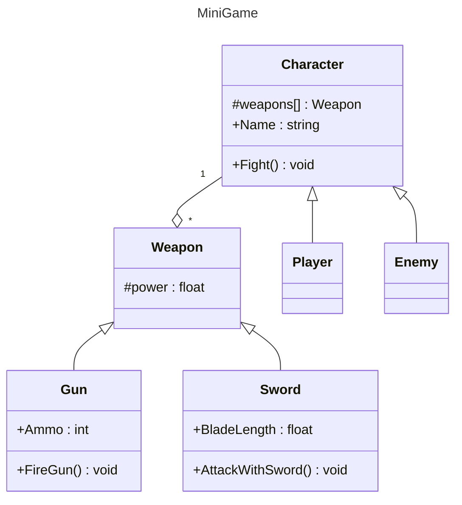

```mermaid
---
title: MiniGame
---
	classDiagram
		Character "1"--o "*" Weapon
		Character <|-- Player
		Character <|-- Enemy
		Weapon <|-- Gun
		Weapon <|-- Sword
	class Character{
		#weapons[] : Weapon
		+Name : string
		+Fight() void
	}
	class Player
	class Enemy
	class Weapon{
		#power : float
	}
	class Gun{
		+Ammo : int
		+FireGun() void
	}
	class Sword{
		+BladeLength : float
		+AttackWithSword() void
	}
```